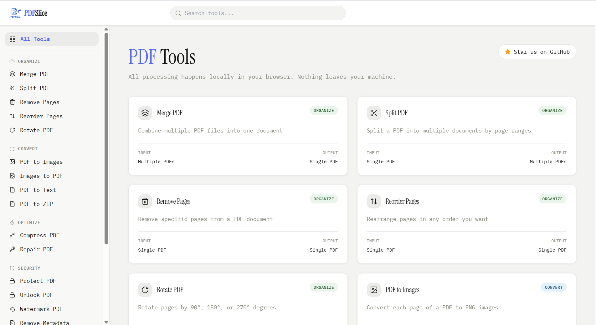

# PDFSlice
A fast, private PDF toolkit right in your browser. No uploads. No servers. Your files never leave your device.



## Features
- Merge multiple PDFs into one  
- Split PDF into specific pages or ranges  
- Remove selected pages from a PDF  
- Reorder pages within a PDF  
- Rotate PDF pages to desired orientation  

- Convert PDF to images  
- Convert images into a single PDF  
- Extract text from PDF  
- Convert PDF into a ZIP archive  

- Compress PDF to reduce file size  
- Repair corrupted or damaged PDFs  

- Protect PDF with password encryption  
- Unlock password-protected PDFs  
- Add watermark to PDF  
- Remove PDF metadata  

- Add page numbers to PDF  
- Crop PDF pages  
- Sign PDF digitally  
- Fill and flatten PDF forms  
- Redact sensitive content from PDF

## Privacy First
100% client side processing using JavaScript. Your PDFs are never uploaded to any server. All operations happen locally and your data stays yours.

## Tech Stack
**Frontend**
- React
- TypeScript
- Vite

**Styling**
- Tailwind CSS

**PDF Processing**
- pdf-lib
- PDF.js
- @hyzyla/pdfcpu

## Getting Started
```bash
git clone https://github.com/ShashwatSricodes/PDFSlice.git
cd PDFSlice
npm install
npm run dev
```

## Star History

[](https://www.star-history.com/?repos=ShashwatSricodes%2FPDFSlice&type=date&legend=top-left)

---
## License
MIT. Built with ❤️ for people who value privacy.
